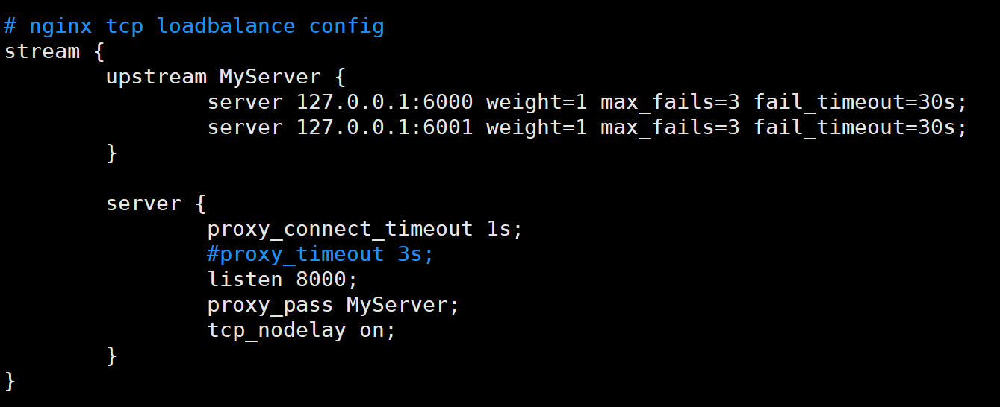
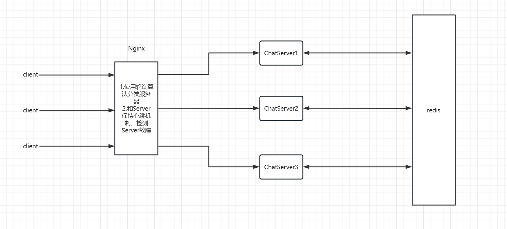

# ChatServer

## 开发环境	

- Linux version 3.10.0（CentOS 7.9 64位）
- gcc version 7.3.0
- cmake version 2.8.12.2
- boost version 1.75.0
- mysql version 8.0.32
- redis version 7.0.4
- nginx version 1.12.2

## 编译

```shell
# 项目编译执行即可，项目生成至bin/文件夹
sudo ./autobuild.sh
```

## 配置环境

### 数据库表设计

User表

| 字段名称 | 字段类型                 | 字段说明 | 约束                        |
| -------- | ------------------------ | -------- | --------------------------- |
| id       | INT                      | 用户id   | PRIMARY KEY、AUTO_INCREMENT |
| name     | VARCHAR(50)              | 用户名   | NOT NULL, UNIQUE            |
| password | VARCHAR(50)              | 用户密码 | NOT NULL                    |
| state    | ENUM('online','offline') | 登录状态 | DEFAULT 'offline'           |

Friend表

| 字段名称 | 字段类型 | 字段说明 | 约束               |
| -------- | -------- | -------- | ------------------ |
| userid   | INT      | 用户id   | NOT NULL、联合主键 |
| friendid | INT      | 好友id   | NOT NULL、联合主键 |

AllGroup表

| 字段名称  | 字段类型    | 字段说明   | 约束                        |
| --------- | ----------- | ---------- | --------------------------- |
| id        | INT         | 组id       | PRIMARY KEY、AUTO_INCREMENT |
| groupname | VARCHAR(50) | 组名称     | NOT NULL,UNIQUE             |
| groupdesc | VARCHAR(50) | 组功能描述 | DEFAULT ' '                 |

GroupUser表

| 字段名称  | 字段类型                 | 字段说明 | 约束               |
| --------- | ------------------------ | -------- | ------------------ |
| groupid   | INT                      | 组id     | NOT NULL、联合主键 |
| userid    | INT                      | 组员id   | NOT NULL、联合主键 |
| grouprole | ENUM('creator','normal') | 组内角色 | DEFAULT 'normal'   |

OfflineMessage表

| 字段名称 | 字段类型     | 字段说明                   | 约束     |
| -------- | ------------ | -------------------------- | -------- |
| userid   | INT          | 用户id                     | NOT NULL |
| message  | VARCHAR(500) | 离线消息（存储Json字符串） | NOT NULL |

```sql
-- 可以使用sql文件导入表
create database chat;
use chat;
source ./source/chat.sql;
```

### Nginx配置

在nginx.conf文件中加入下面文字



## 项目内容：

1. 使用muduo网络库作为项目的网络层核心模块，提供高并发网络I/O服务，解耦网络和业务模块代码
2. 使用json序列化和反序列化消息作为私有通信协议
3. 使用mysql关系型数据库作为项目数据的存储，并使用数据库连接池减少访问数据库带来的性能降低
4. 使用nginx基于tcp的负载均衡和轮询算法，实现服务器的集群功能，提高服务器的并发能力
5. 使用redis的发布-订阅功能，实现跨服务器的消息通信

## 服务器架构



### 收获

熟悉了基于开源网络库进行框架的设计，掌握了json的序列化和反序列化，mysql表设计，redis的应用，nginx的负载均衡配置。

## 问题以及解决方案

### 问题：

1.MySQL数据库（基于C/S设计）的访问存在瓶颈，在高并发场景中，大量的TCP三次握手、MySQL Server连接认证、MySQL Server关闭连接回收资源和TCP四次挥手所耗费的性能时间太多，减低服务器性能。

### 解决方案：

1.使用redis进行缓存数据库的部分数据或者使用MySQL连接池。
